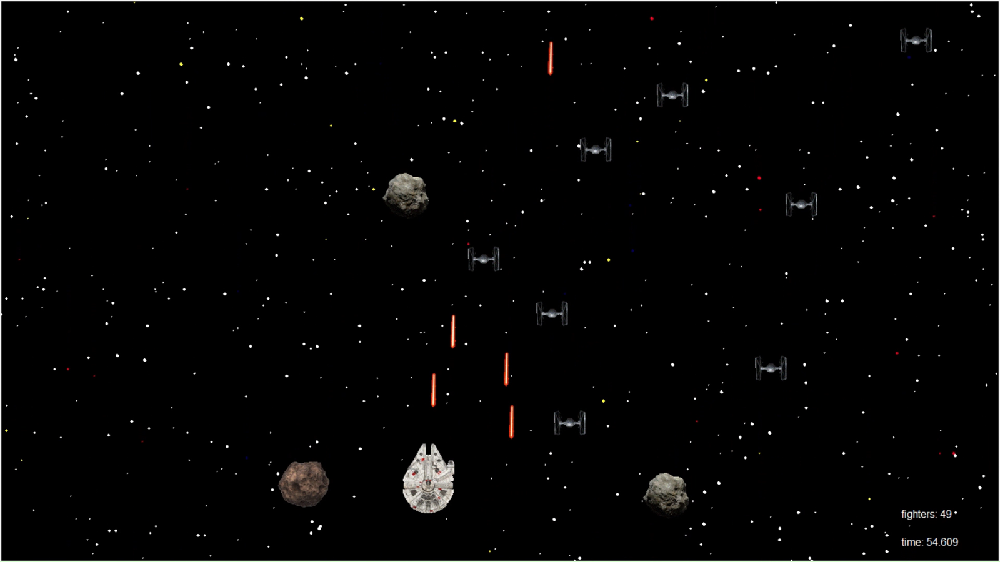

# Star Wars Game

This project was submitted as a requirement for the Industrial Engineering course at the Federal University of Rio de Janeiro. It was presented in fulfillment of the requirements for the Programming 2 class in 2016. The game is developed in Python, incorporating Object-Oriented Programming (OOP) principles, and utilizes the Tkinter library for the graphical user interface.

## Features

- Navigate the Millenium Falcon to destroy TIE Fighters and asteroids.
- Earn points for each enemy destroyed.
- Challenge yourself with increasing difficulty levels.
- Compete for the highest score and see your rank in the leaderboard.

## Screenshots

## How to Play

1. Run the `Game.pyw` file to start the game.
2. Use the left and right arrow keys to move the Millenium Falcon.
3. Press the spacebar to shoot lasers and destroy enemies.
4. Survive as long as possible and aim for the highest score.

## Requirements

- Python 3.x
- Tkinter library

## Contributing
Feel free to contribute to the project by opening issues or pull requests. Your feedback is valuable.

## License
This project is licensed under the MIT License - see the LICENSE file for details.

## Acknowledgments
Sound effects obtained from SoundBible.
GIFs and images from the Star Wars universe.